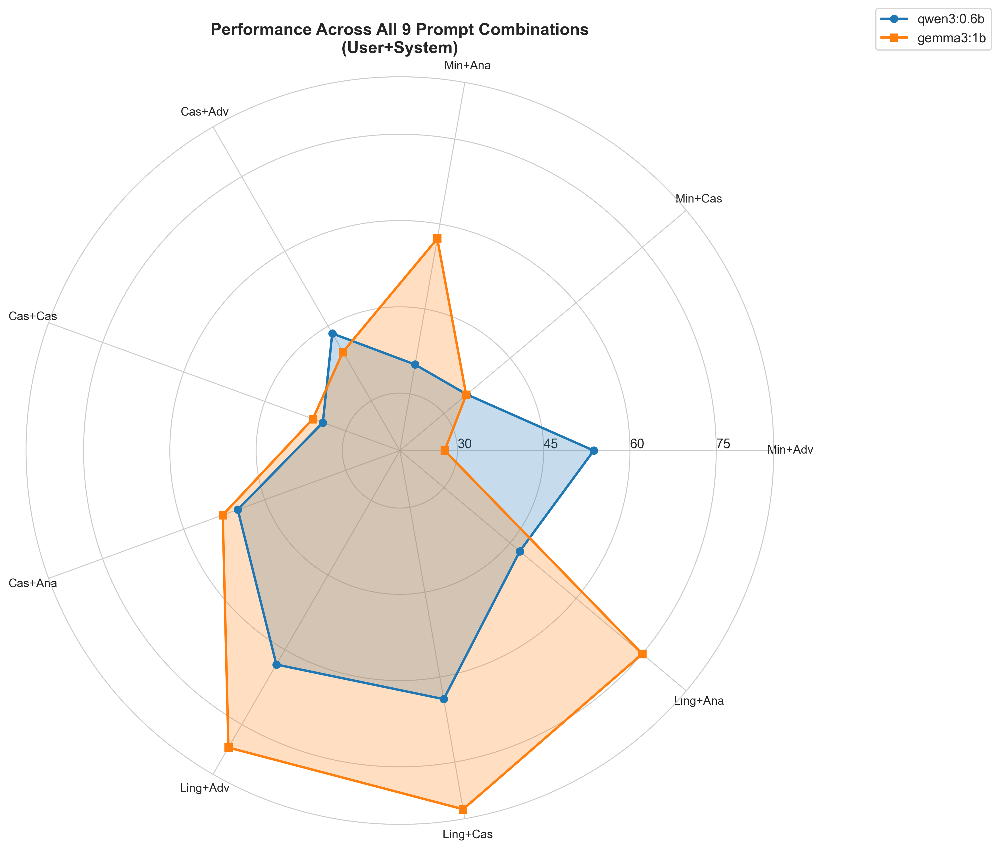
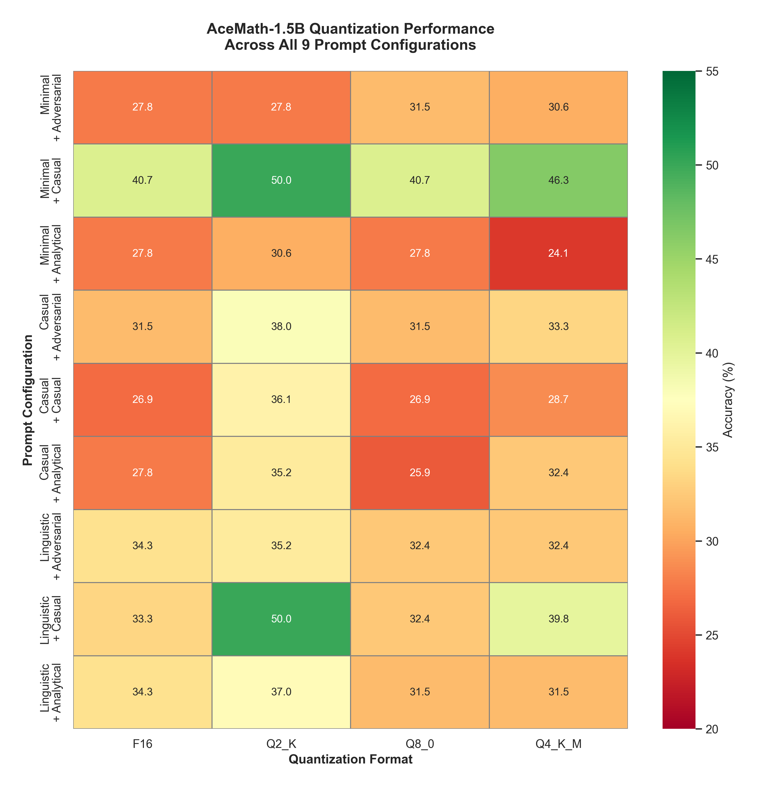

# GoL Procedural Benchmark

A procedural benchmark suite for testing multilingual LLM reasoning capabilities across tasks requiring step-by-step logic and systematic rule application.

[](https://opensource.org/licenses/MIT)
[](https://www.python.org/downloads/)

---

## What Is This?

GoL Benchmark is a **semi *vibe* coded pet project evolved to experimental playground** for stress-testing how well language models handle **structured reasoning tasks** across different:

- **Languages** (English, Spanish, French, German, Chinese, Ukrainian)
- **Prompt styles** (linguistic, casual, minimal — each plugin owns its templates)
- **Representations** (numeric `1/0` vs emoji `🟩/🟥` and etc)
- **Complexity levels** (from easy to nightmare mode)

Think of it as a systematic benchmark for LLMs to expose their reasoning gaps, biases, and quirks.

---

## What Gets Tested?

| # | Task | What It Tests |
| --- | ------ | --------------- |
| 1 | **Game of Life (GoL)** | Conway's cellular automaton — predict next grid state |
| 2 | **Arithmetic (ARI)** | Math expression parsing and evaluation |
| 3 | **Linda Conjunction Fallacy** | Cognitive bias — conjunction fallacy detection |
| 4 | **Cellular Automata 1D (C14)** | Wolfram 1D rule application (rules 0–255) |
| 5 | **ASCII Shapes** | Spatial reasoning on ASCII art (dimensions, counts, positions) |
| 6 | **Object Tracking** | Physical state tracking through container inversions |
| 7 | **Sally-Anne Test** | Theory of Mind — false belief reasoning |
| 8 | **Carwash Paradox** | Practical goal tracking — walk or drive? (always drive) |
| 9 | **Inverted Cup** | Spatial orientation — sealed top/open bottom cup (flip it) |
| 10 | **Strawberry** | Character-level reasoning: letter counting, word reversal, nth-letter, anagram, pangram, lipogram |
| 11 | **Measure Comparison** | Quantity comparison with units, conversion traps, and decimal framing sensitivity |
| 12 | **Grid Tasks** | Table reasoning — cell lookups, row sums, column counts |
| 13 | **Time Arithmetic** | Temporal reasoning — intervals, calendar math, impossible dates, AM/PM traps |
| 14 | **Misquote Attribution** | Sycophancy detection — false quote attributions with social-pressure framings |
| 15 | **False Premise** | Dangerous/impossible premise detection — 5 domains (chemistry, medicine, food safety, physics, logic) |
| 16 | **Family Relations** | Perspective-aware family counting puzzles — sibling count, shared children, generational, perspective shift |
| 17 | **Encoding & Cipher Decoding** | Decode-and-respond across encoding schemes (Base64, Caesar/ROT-N, Morse) with hallucination detection |
| 18 | **Symbol Arithmetic** | Evaluate expressions under arbitrary binary operations (custom operation tables, commutativity/associativity detection) |
| 19 | **Picross (Nonogram)** | Grid-based deductive reasoning — solve puzzles from row/column clue constraints |

---

## Quick Start

### Prerequisites

- **Python 3.8+**
- **[Ollama](https://ollama.ai/)** (for running local LLMs)

### Installation

```bash
# Clone the repo
git clone https://github.com/AlexSabaka/gol-benchmark.git
cd gol-benchmark

# Install dependencies
pip install -r requirements.txt

# Make sure Ollama is running
ollama serve

# (Optional) use a remote Ollama instance
# Pass --ollama-host http://remote-host:11434 to run_testset.py
```

### Run Your First Benchmark

**Web UI (Recommended)**

```bash
# Start the backend + frontend
python -m src.web
# Open http://127.0.0.1:8000/ in your browser

# The web UI is a React SPA (Vite + React 19 + TypeScript + Tailwind CSS + shadcn/ui)
# Frontend source in frontend/, served at /
# REST API at /api/
```

**CLI — 3-Stage Pipeline**

```bash
# Stage 1: Generate test set from YAML config
python src/stages/generate_testset.py configs/my_benchmark.yaml

# Stage 2: Run against a model
python src/stages/run_testset.py testsets/testset_*.json.gz \
    --model qwen3:0.6b --provider ollama

# Stage 3: Analyze results
python src/stages/analyze_results.py results/*.json.gz --visualize
```

**CLI — Legacy Benchmark Scripts**

```bash
# Game of Life
python -m src.benchmarks.gol_eval --model qwen3:0.6b --difficulty medium \
    --batch-size 20 --no-think --live-dead-cell-markers "1,0"

# Arithmetic
python -m src.benchmarks.ari_eval --model llama3.2:3b --difficulty 3 --batch-size 10

# Linda fallacy in Spanish
python -m src.benchmarks.linda_eval --model gemma3:1b --language es --trials 10
```

---

## 📊 Model Performance Leaderboard

### Overall Rankings (Best to Worst)

| Rank | Model | Best Config | Accuracy | Notes |
|------|-------|-------------|----------|-------|
| 🥇 **1** | **gemma3:1b** | linguistic + casual | **83.33%** | Peak performer, high sensitivity to prompts |
| 🥈 **2** | **qwen3:0.6b** | linguistic + casual | **63.89%** | Pragmatist, prefers adversarial prompts |
| 🥉 **3** | **AceMath-1.5B (Q2_K)** | minimal/linguistic + casual | **50.00%** | Surprising: extreme quantization → better performance |
| 4 | AceMath-1.5B (Q4_K_M) | minimal + casual | 46.30% | Balanced quantization |
| 5 | AceMath-1.5B (F16) | minimal + casual | 40.74% | Full precision baseline |
| 6 | AceMath-1.5B (Q8_0) | minimal + casual | 40.74% | Underperformer among quantizations |

### Study 1: General Purpose Models (972 evaluations)

**Gemma3 vs Qwen3 Across 9 Prompt Configurations**



| Configuration | qwen3:0.6b | gemma3:1b | Winner |
|---------------|-----------|-----------|--------|
| Minimal + Adversarial | 53.70% | 27.78% | qwen3 ✓ |
| Minimal + Casual | 35.19% | 35.05% | Tie |
| Minimal + Analytical | 35.19% | 57.41% | gemma3 ✓ |
| Casual + Adversarial | 43.52% | 39.81% | qwen3 ✓ |
| Casual + Casual | 34.26% | 36.11% | gemma3 ✓ |
| Casual + Analytical | 50.00% | 52.78% | gemma3 ✓ |
| Linguistic + Adversarial | 62.96% | 79.63% | gemma3 ✓ |
| Linguistic + Casual | 63.89% | **83.33%** | gemma3 ✓✓ |
| Linguistic + Analytical | 47.22% | 75.00% | gemma3 ✓ |

**Key Finding:** gemma3:1b peaks at **83.33%** (linguistic user + casual system)

---

### Study 2: AceMath-1.5B Quantization Analysis (3,888 evaluations)

**Four Quantization Formats Across 9 Configurations**



| Rank | Format | Average | Range | Best Config | Use Case |
|------|--------|---------|-------|-------------|----------|
| 🥇 | **Q2_K** | **37.76%** | 30.56-50.00% | **50.00%** | Research, edge deployment |
| 🥈 | Q4_K_M | 33.23% | 24.07-46.30% | 46.30% | Balanced production |
| 🥉 | F16 | 31.58% | 26.85-40.74% | 40.74% | Stable production |
| 4 | Q8_0 | 31.17% | 25.93-40.74% | 40.74% | Stable production |

**Key Finding:** Q2_K (2-bit extreme quantization) achieves **+6.18% improvement** over F16 baseline with **87.5% compression**  

### Key Discoveries

#### 1. System Prompts Act as Reasoning Switches 🧠

System prompts don't just set tone—they **activate different reasoning strategies**:

- **gemma3:1b with analytical system prompt:** +22.4 points vs casual baseline
- **qwen3:0.6b with adversarial system prompt:** +18.5 points vs casual baseline
- Same model, same task, different system prompt = fundamentally different reasoning approach

#### 2. Models Have Opposite Personalities 🎭

- **qwen3:0.6b:** "The Pragmatist" — thrives with efficiency-first (adversarial) prompts
- **gemma3:1b:** "The Analyst" — thrives with depth-focused (analytical) prompts

This reflects their architectural design: qwen optimizes for speed, gemma for accuracy.

#### 3. Instruction Saturation Effect ⚠️

When both user AND system prompts are highly detailed, performance can DROP:

```
gemma3:1b with detailed (linguistic) user prompts:
  Casual system:      83.33% (BEST)
  Analytical system:  75.00% (DROPS 8.3 points due to over-constraint!)
```

Too much guidance creates interference rather than synergy.

#### 4. User Prompt Quality Matters Most 📝

Improvement from minimal → linguistic user prompts:
- qwen3:0.6b: +28.7 points
- gemma3:1b: +48.3 points

**Investment in detailed user prompt guidance has massive ROI.**

#### 5. Model Robustness Differs 1.93×

- **qwen3:0.6b:** 35-63% performance range = ROBUST to poor prompts
- **gemma3:1b:** 27-83% performance range = SENSITIVE to prompt engineering

---

## Key Findings from Game of Life & Other Tasks

### The Emoji Catastrophe 🟩🟥 *(Fixed in v2.10.1)*

**Historical note:** Using emoji markers (`🟩/🟥`) instead of numeric (`1/0`) used to cause complete failure due to a generator bug. This has been fixed — custom cell markers (including emoji) now work correctly.

However, models still perform significantly better with numeric markers:

| Model | Numeric (1/0) | Emoji (🟩/🟥) |
|-------|---------------|----------------|
| qwen3:0.6b | 61.67% | **0.00%** |
| gemma3:1b | 66.11% | **0.00%** |

> The accuracy difference above reflects both the old generator bug and genuine model difficulty with emoji grids. With the fix, emoji markers are a valid robustness test.

### Prompt Style Impact

- **Examples-based prompts** work best for GoL (66% accuracy)
- **Minimal prompts** show surprising resilience (56-60% accuracy)
- **"Thinking" mode** (chain-of-thought) often hurts performance on structured tasks

---

---

## 🚀 AceMath-1.5B Quantization Analysis

---

## 📖 Documentation & Analysis

All analysis reports and visualizations have been organized in the `docs/` directory:

### Reports
- **[docs/PROMPT_ANALYSIS_REPORT.md](./docs/PROMPT_ANALYSIS_REPORT.md)** — Detailed analysis of qwen3 vs gemma3 (550+ lines, 9 configurations)
- **[docs/ACEMATH_QUANTIZATION_REPORT.md](./docs/ACEMATH_QUANTIZATION_REPORT.md)** — Comprehensive AceMath quantization study (522 lines, 4 formats)
- **[docs/ACEMATH_QUANTIZATION_STUDY_SUMMARY.md](./docs/ACEMATH_QUANTIZATION_STUDY_SUMMARY.md)** — Quick reference summary of findings
- **[docs/VISUALIZATIONS_GUIDE.md](./docs/VISUALIZATIONS_GUIDE.md)** — Interpretation guide for all charts

### Visualizations
- **[docs/images/original_gemma3_qwen3/](./docs/images/original_gemma3_qwen3/)** — 9 charts from qwen3/gemma3 study (300 DPI)
- **[docs/images/acemath_quantization/](./docs/images/acemath_quantization/)** — 11 charts from AceMath quantization study (300 DPI)

### Reproducible Analysis Scripts
- **[docs/generate_prompt_analysis_visualizations.py](./docs/generate_prompt_analysis_visualizations.py)** — Generate qwen3/gemma3 visualizations
- **[docs/generate_acemath_quantization_visualizations.py](./docs/generate_acemath_quantization_visualizations.py)** — Generate AceMath visualizations

---

## Configuration Options

### Key Parameters

```bash
# Prompt styles (user prompt)
--prompt-style minimal|casual|linguistic|examples|rules_math

# System prompt styles
--system-prompt-style analytical|casual|adversarial|none

# Languages
--prompt-language en|es|fr|de|zh|ua

# Cell markers (GoL only — numeric recommended for best accuracy)
--live-dead-cell-markers "1,0"

# Disable chain-of-thought (recommended for structured tasks)
--no-think

# Reproducibility
--seed 42
```

See [CLAUDE.md](.claude/CLAUDE.md) for full configuration reference.

---

## Contributing

This is a **personal experiment**, but if you're curious and want to:

- Add new benchmark tasks
- Test more models
- Improve prompt engineering
- Fix bugs or add features

**Pull requests are welcomed!**

---

## Roadmap

### ✅ Completed

- [x] Plugin-based benchmark architecture — **19** tasks with auto-discovery (v2.1.0+)
- [x] 3-stage pipeline: generate → execute → analyze
- [x] React SPA web UI (Vite + React 19 + TypeScript + shadcn/ui) (v2.11.0)
- [x] Plugin config schema introspection (`ConfigField` system)
- [x] PromptEngine with 6 languages, 5 user styles, 4 system styles
- [x] Remote Ollama + OpenAI-compatible + HuggingFace providers
- [x] Token counting throughout pipeline
- [x] End-first parsing convention across all parsers
- [x] Verification-section stripping for end-first parsers (v2.10.3, ~91 false negatives fixed)
- [x] Carwash parser expanded conditional/dismissive walk filtering (v2.10.4, 15 false negatives fixed)
- [x] Measure comparison parser overhaul (v2.10.5, 38 false negatives fixed — smart quote normalization, pipeline reorder, expanded keyword patterns)
- [x] Object tracking, time arithmetic, inverted cup, encoding cipher parser fixes (v2.10.6, 28 false negatives fixed — first-bold/first-sentence strategies, validity yes/no detection, tilt/tip patterns, Unicode whitespace normalization)
- [x] False premise parser overhaul (v2.10.7, 61 false negatives fixed — smart quote normalization, negation-aware compliance detection, safe-alternative section filtering, first-sentence refusal strategy, expanded refusal/impossibility patterns)
- [x] Web UI improvements: Jobs page, faceted filters, plugin descriptions from README, Configure/Execute page split (v2.12.0)
- [x] Full multilingual support: all 19 plugins have 6-language prompts, multilingual data files (strawberry, encoding_cipher), and multilingual response parsing across all 13 heuristic parsers
- [x] UI & Workflow improvements: reanalysis endpoint, custom system prompts, chart filtering (task/language/log scale), Param Override Modal, favorites sidebar, encrypted credential storage (v2.14.0)
- [x] Deep multilingual content localization: all 19 plugins generate test content in 6 languages, not just prompt wrappers (v2.15.0)
- [x] LLM-as-a-Judge: audit incorrect model responses via judge LLM with web UI setup and background job execution
- [x] Test Sets and Results browsing upgrade: independent `Table/Cards` format toggle plus collapsible Airtable-style grouped rows in table mode (v2.17.0)
- [x] Web UI workflow polish: Execute now uses a paginated checkbox grid for test set multi-select, Results language filters match Test Sets with flag + full-name labels, long filenames no longer break dialog CTA layouts, and Jobs can cancel already-running inference/judge work cooperatively (v2.17.1)

### 🔄 In Progress

- [x] Cross-lingual/cross-cultural generation problems

### 📋 Planned

- [x] Multi-language validation (French, Spanish, German, Chinese, Ukrainian)
- [ ] More languages (Japanese, Arabic, Hindi)
- [ ] Cross-lingual transfer tests
- [ ] Fine-grained system prompt optimization
- [ ] Chain-of-thought impact analysis
- [ ] Scaling studies (7B, 13B, 70B models)
- [ ] Add statistical significance testing
- [ ] Production recommendation framework

---

## License

See [LICENSE](LICENSE) for details.

---

## 🙏 Acknowledgments

- Conway's Game of Life rules
- The Ollama team for making local LLM testing accessible
- Anthropic AI team
- OpenSource community
- Every model that crashed on tests
